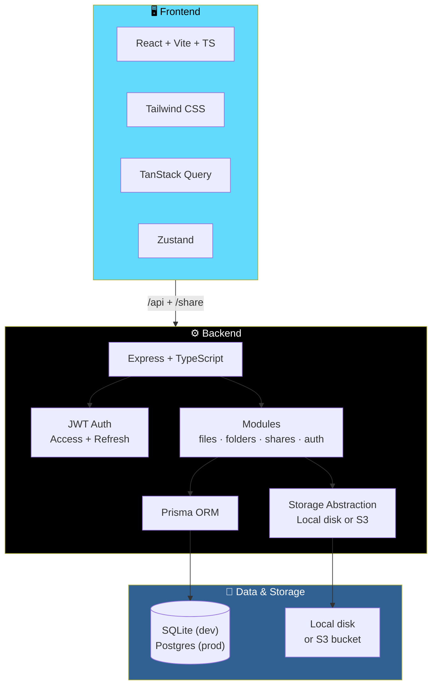

# 🗄️ Vault — Personal Cloud Drive

<div align="center">


**A full-stack, simplified Google Drive clone.**

*Auth · Folders · Uploads · Trash · Search · Sharing · Storage dashboard*

[✨ Features](#-features) • [🏗️ Architecture](#-architecture) • [🚀 Running It](#-running-it) • [☁️ Production Switches](#-switching-to-s3-in-production) • [📝 Notes](#-notes-on-whats-implemented)

</div>

---

## 📖 Overview

**Vault** is a full-stack personal cloud drive — a simplified Google Drive clone that covers the entire essential workflow: authentication, folders, file upload/download/preview, trash, search, sharing, and a storage dashboard.

### Core Idea

> **Everything you need from a cloud drive. Nothing you don't.**
>
> A clean, production-shaped architecture that swaps between local disk and S3, SQLite and Postgres, without touching a single line of application code.

---

## ✨ Features

<div align="center">

| 🔐 Authentication | 📁 Folders |
|:---:|:---:|
| JWT access + refresh token flow | Create, nest, and organize with drag-and-drop |
| **📤 Upload & Download** | **👁️ File Preview** |
| Drag-and-drop uploads with quota enforcement | Preview supported files in the browser |
| **🗑️ Trash** | **🔍 Search** |
| Soft-delete with restore and permanent delete | Find files and folders quickly |
| **🔗 Sharing** | **📊 Storage Dashboard** |
| Public links with optional password, expiry, and permission level | Visualize storage usage against your quota |

</div>

### Detailed Feature List

#### 📁 File & Folder Management

- **Drag-and-drop uploads** — drop a file anywhere on the dropzone
- **Folder creation** and nesting
- **Move files** by dragging them onto a folder
- **File preview** in the browser for supported types
- **Download** any file with a single click

#### 🗑️ Trash System

Soft-delete powers the Trash for **both files and folders**:

1. **Delete** a file → it moves to Trash
2. **Restore** it from the Trash page — back where it was
3. **Permanently delete** — also removes the underlying storage object

#### 🔗 Sharing

Public share links at **`/share/:token`** with:

| Option | Details |
|--------|---------|
| **Optional password** | Protect the link with a secret |
| **Optional expiry** | Auto-expire the link after a date |
| **Permission level** | **View-only** or **download allowed** |

Share links are **copied to your clipboard automatically** when created.

#### 📊 Storage Dashboard

- Visualize storage usage against your quota
- **Quota enforced on upload and copy**

#### 🛡️ Security

- **Executable and script file extensions are blocked on upload** as a basic malware-vector guard
- Adjust the blocklist in `backend/src/modules/files/files.validation.ts`

---

## 🏗️ Architecture



### Tech Stack

| Layer | Technology |
|-------|-----------|
| **Backend runtime** | Node.js |
| **Backend framework** | Express |
| **Backend language** | TypeScript |
| **ORM** | Prisma |
| **Database (dev)** | SQLite |
| **Database (prod)** | PostgreSQL |
| **Auth** | JWT (access + refresh) |
| **Storage** | Local disk or S3 |
| **Frontend framework** | React |
| **Frontend build** | Vite |
| **Frontend language** | TypeScript |
| **Styling** | Tailwind CSS |
| **Data fetching** | TanStack Query |
| **State** | Zustand |

### Design Principles

- **Storage is abstracted** — `src/storage/index.ts` picks the driver at startup, so switching to S3 needs **no code changes**
- **Soft-delete is universal** — files and folders both use `deletedAt`, so Trash works uniformly
- **Quota is enforced server-side** — on upload and on copy
- **Permissions are per-share** — view-only or download, with optional password and expiry

---

## 🚀 Running It

### 1. Backend

```bash
cd backend
cp .env.example .env      # edit JWT_ACCESS_SECRET / JWT_REFRESH_SECRET first
npm install
npx prisma migrate dev --name init   # creates dev.db and applies the schema
npm run dev
```

**API runs at** `http://localhost:4000`
**Health check:** `GET /api/health`

> ⚠️ **Set the JWT secrets before starting** — don't leave them at the example values.

### 2. Frontend

```bash
cd frontend
npm install
npm run dev
```

**App runs at** `http://localhost:5173` and **proxies `/api` and `/share`** to the backend (see `vite.config.ts`).

### 3. Try It

1. Open **`http://localhost:5173/register`** and create an account
2. **Upload a file** by dragging it onto the dropzone
3. **Create a folder**, then **drag a file onto it** to move it
4. **Share a file** — right-click-style "…" menu → Share → creates a public link at `/share/:token`, **copied to your clipboard automatically**
5. **Delete a file** → check the **Trash page** → restore it or delete it forever

---

## ☁️ Switching to S3 in Production

Set in **`backend/.env`**:

```env
STORAGE_DRIVER=s3
S3_BUCKET=your-bucket
S3_REGION=us-east-1
S3_ACCESS_KEY_ID=...
S3_SECRET_ACCESS_KEY=...

# S3_ENDPOINT + S3_FORCE_PATH_STYLE=true
# if using MinIO / R2 / B2 instead of AWS
```

> 💡 **No code changes needed** — `src/storage/index.ts` picks the driver at startup.

### Compatible Storage Providers

| Provider | Notes |
|----------|-------|
| **AWS S3** | Default — no `S3_ENDPOINT` needed |
| **Cloudflare R2** | Set `S3_ENDPOINT` + `S3_FORCE_PATH_STYLE=true` |
| **Backblaze B2** | Same S3-compatible setup |
| **MinIO** | Same — great for local S3 testing |

---

## 🐘 Switching to Postgres in Production

In **`backend/prisma/schema.prisma`**, change:

```prisma
datasource db {
  provider = "postgresql"
  url      = env("DATABASE_URL")
}
```

Then:

1. Update `DATABASE_URL` to a Postgres connection string
2. **Delete the SQLite migration folder**
3. Run `npx prisma migrate dev --name init` again to generate a **Postgres-flavored migration**

---

## 📝 Notes on What's Implemented

<div align="center">

| Feature | Implementation |
|---------|---------------|
| **🗑️ Trash for files and folders** | Soft-delete via `deletedAt`; permanent delete also removes the underlying storage object |
| **📊 Storage quota** | Enforced on **upload and copy** |
| **🔗 Share links** | Optional password · optional expiry · view-only or download permission |
| **🛡️ Malware guard** | Executable/script file extensions blocked on upload |
| **🔧 Adjustable blocklist** | Edit `backend/src/modules/files/files.validation.ts` |

</div>

---

## 🗺️ Roadmap

### ✅ Current

- [x] Registration and login with JWT access + refresh tokens
- [x] Folder creation and nesting
- [x] Drag-and-drop file uploads
- [x] Drag-to-move files between folders
- [x] File preview in the browser
- [x] File download
- [x] Soft-delete Trash for files and folders
- [x] Restore from Trash
- [x] Permanent delete with storage cleanup
- [x] Search across files and folders
- [x] Public share links with password, expiry, and permission level
- [x] Clipboard auto-copy on share creation
- [x] Storage dashboard with quota visualization
- [x] Quota enforcement on upload and copy
- [x] Executable/script extension blocklist
- [x] Storage abstraction (local disk or S3)
- [x] Prisma schema ready for SQLite or Postgres

### 🔜 Future Ideas

- [ ] File versioning
- [ ] Collaborative folders / shared workspaces
- [ ] Bulk operations (multi-select, batch move, batch delete)
- [ ] File preview for more formats (video, code with syntax highlighting)
- [ ] Thumbnail generation for images and videos
- [ ] Recent files view
- [ ] Starred / favorites
- [ ] Storage analytics over time
- [ ] Two-factor authentication
- [ ] Activity log / audit trail

---

## 🤝 Contributing

Contributions are welcome. Please:

1. Fork the repository
2. **Preserve the storage abstraction** — new drivers go in `src/storage/`, not in the modules
3. **Enforce quota server-side** — never trust the client
4. **Soft-delete by default** — hard-delete only through the Trash permanent-delete path
5. **Validate uploads** — extend the blocklist for new threat categories
6. Submit a Pull Request

### Guidelines

- **Never bypass the storage abstraction** — always go through `src/storage/index.ts`
- **Never trust a client-supplied file size or MIME type**
- **Never return a share link without validating its permissions**
- **Never hard-delete on the first delete** — always soft-delete first
- **Never store unhashed passwords** — use the existing auth flow

---

## 📜 License

MIT — see [LICENSE](LICENSE) for details.

---

## 🙏 Acknowledgments

- **Google Drive** — for the interface conventions this project borrows
- **Prisma** — for making database portability real
- **TanStack Query** — for making data fetching feel inevitable
- **Zustand** — for making state management feel small

---

<div align="center">

### 🗄️ UPLOAD. ORGANIZE. SHARE. RESTORE.

**A personal cloud drive with production-ready switches.**

**SQLite in dev. Postgres in prod. Local disk or S3. No code changes.**

<br>

⭐ If this project helped you, consider giving it a star.

<br>

[⬆ Back to Top](#️-vault--personal-cloud-drive)

</div>
